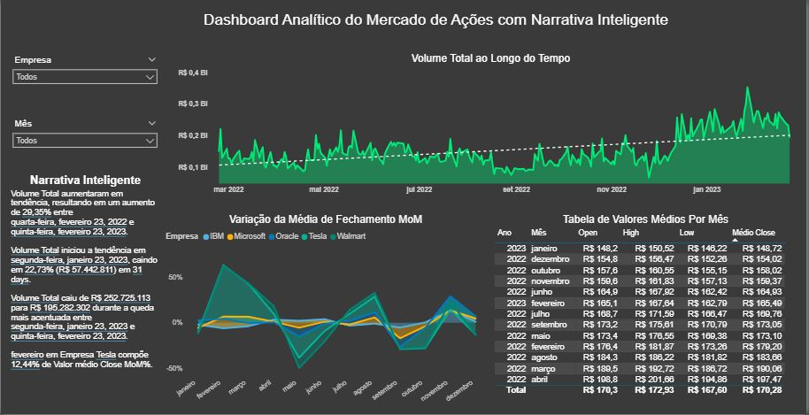

# Dashboard Analítico do Mercado de Ações

---

## Sobre o Projeto

Este projeto foi desenvolvido como um mini-case de Business Intelligence utilizando Power BI e dados reais do mercado financeiro.

O objetivo foi construir um dashboard analítico capaz de acompanhar o comportamento de ações de grandes empresas ao longo do tempo, utilizando recursos de análise temporal (**Time Intelligence**) e **Narrativa Inteligente**.

As empresas analisadas foram:

- IBM
- Microsoft
- Oracle
- Tesla
- Walmart

Os dados foram extraídos da plataforma oficial da Nasdaq.

---

# Objetivo do Dashboard

Construir um painel analítico capaz de responder às seguintes perguntas de negócio:

---

## Volume negociado ao longo do tempo

- Qual o volume total de ações negociadas?
- Como o volume varia ao longo do período?
- Possibilidade de filtrar por empresa individualmente.

---

## Média mensal dos indicadores financeiros

Analisar os valores médios de:

- Open
- High
- Low
- Close

Exibidos em formato tabular por mês.

---

## Variação mensal do fechamento das ações

- Comparação Month over Month (MoM)
- Evolução da média do valor de fechamento ao longo do tempo.

---

## Narrativa Inteligente

Uso do recurso de IA do Power BI para gerar insights automáticos sobre:

- Tendências
- Crescimentos
- Quedas
- Mudanças relevantes nos dados

---

# Ferramentas Utilizadas

- Power BI
- Power Query
- DAX
- Time Intelligence
- Narrativa Inteligente
- Modelagem de Dados

---

# Principais Recursos Aplicados

## Time Intelligence

Utilizado para:

- análise temporal;
- comparação mensal;
- evolução histórica;
- cálculo de variações ao longo do tempo.

---

## Narrativa Inteligente

Recurso utilizado para gerar explicações automáticas sobre os dados, permitindo identificar:

- tendências;
- maiores variações;
- períodos de crescimento e queda.

---

## Interatividade

O dashboard permite:

- filtros por empresa;
- filtros por período;
- análise dinâmica dos indicadores.

---

# Insights Obtidos

- Identificação de períodos de alta volatilidade nas ações.
- Comparação do comportamento financeiro entre empresas de diferentes setores.
- Análise do volume negociado ao longo do tempo.
- Entendimento da evolução do preço médio de fechamento das ações.

---

# Habilidades Demonstradas

## Power BI

- Criação de dashboards analíticos
- Storytelling com dados
- Design de dashboards
- Criação de medidas DAX
- Modelagem de dados

---

## Análise de Dados

- Séries temporais
- Análise financeira
- Interpretação de indicadores
- Geração de insights

---
## Preview do Dashboard

